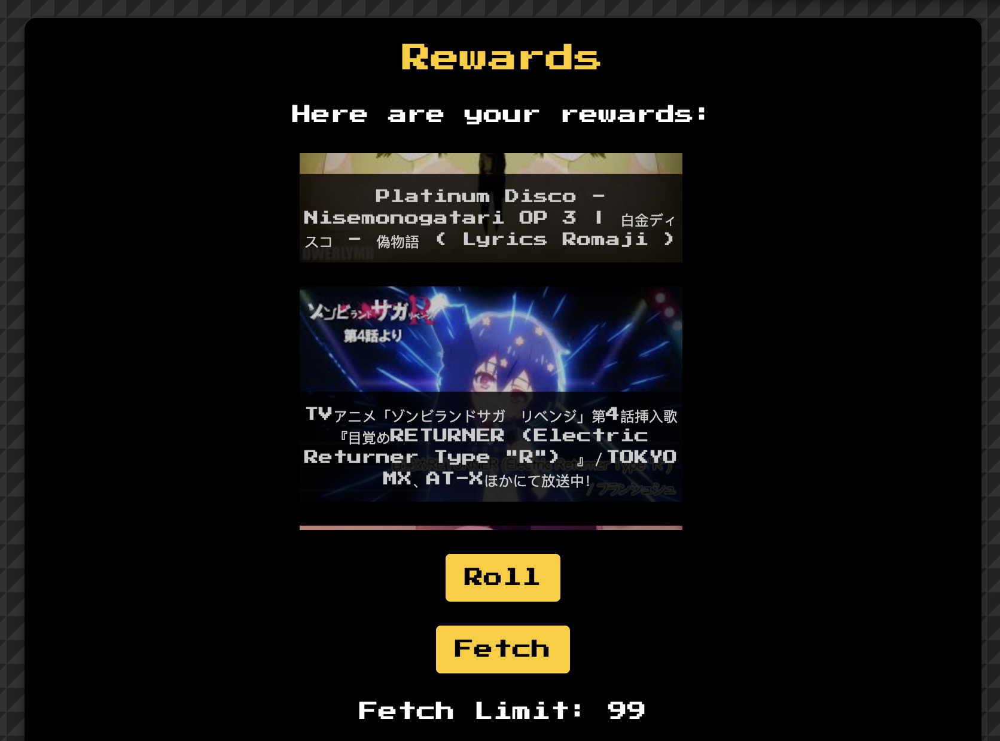

# BBFWEB - Productivity Enhancer

**bbfweb** is optimizing brain function for increased motivation and productivity using reinforcement learning (psychology).

(Rewards rolling)

## Features
- Task Management
- Dashboard
- Gamification
- Personalized Rewards

### Rewards
This app employs brain exploits by using YouTube videos as rewards. Users can input their preferred video IDs in their profiles, and the app will generate reward videos based on these preferences. Rewards rolling requires a small amount of points to redeem a video from the existing pool. Fetching generates an entirely new selection based on user settings and requires more points.

## Points
Points are earned by completing tasks and can be used to obtain rewards.

## Principle
1. User creates a task.
2. Task is completed.
3. User receives a video reward.
4. The reward is not exactly what the user really wanted.
5. User begins a new task, anticipating a better reward.

## Screenshots
Tasks:

Random Reward Won:

Settings:

